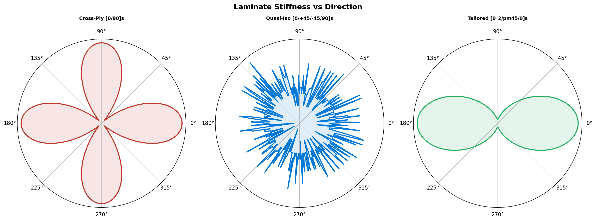
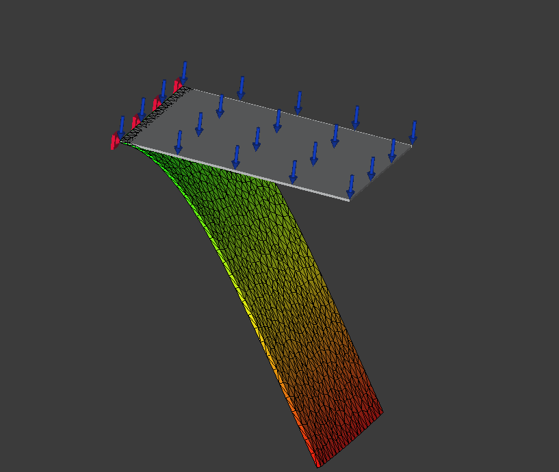
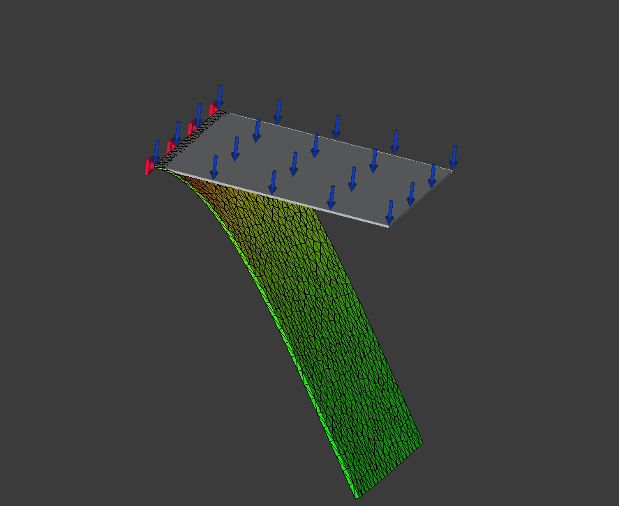

# CFRP Composite Laminate Analysis for Aerospace
 

 
## Overview
Three CFRP layup configurations analyzed using Classical
Lamination Theory and FEA for aerospace structures.

**FEA Displacement** 

**FEA Vonmises**

## Material: Hexcel IM7/8552
| eLamX Field | Value |
|-------------|-------|
| E∥ | 171,000 MPa |
| E⟂ | 9,080 MPa |
| G∥⟂ | 5,290 MPa |
| v∥⟂ | 0.32 |
| Ply thickness | 0.131 mm |
 
## Layups
| Layup | Sequence | Application |
|-------|----------|-------------|
| Cross-Ply | [0/90]s | Floor panels |
| Quasi-Isotropic | [0/+45/-45/90]s | A350 fuselage |
| Tailored | [0₂/±45/0]s | VTP skins |
 
## Tools (Free)
- eLamX (TU Dresden), Python + NumPy, FreeCAD FEM
 
## Author
**Oscar Vincent Dbritto** | M.Sc. Digitalization & Automation | [Portfolio](https://oscardbritto.framer.website/) | [Linkedin](https://www.linkedin.com/in/oscar-dbritto/)
